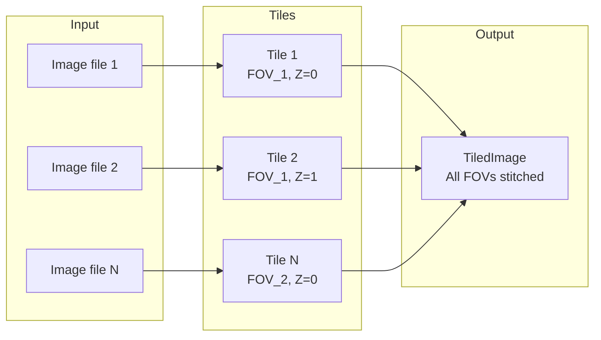
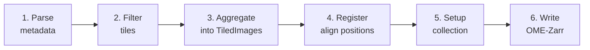

# OME-Zarr Converters Tools { .ozct-visually-hidden }

{ .ozct-hero-logo }
{ .ozct-hero-logo }

**Shared tooling for building OME-Zarr converters — tiles in, OME-Zarr out.**

Every microscope writes its own flavour of metadata, but every converter that reads it
has the same job afterwards: work out where each tile belongs, resolve overlaps, and
write a valid [OME-Zarr](https://ngff.openmicroscopy.org/) image or HCS plate. This
library is that second half. It handles tile management, registration, filtering,
validation and writing, and adds [Fractal](https://fractal-analytics-platform.github.io/)
utilities for packaging a converter as a task.

## Key features

- **Abstraction layer** — map on-disk raw data to `Tile` objects, and let the pipeline
  turn them into OME-Zarr images and HCS plates.
- **Configurable pipeline** — [filter, validate, register and tile](guides/pipeline.md)
  with built-in steps, or plug in your own.
- **Flexible input** — parse tiles from a pandas `DataFrame`, or
  [build them programmatically](getting_started/2_programmatic_tiles.md) with a custom
  image loader.
- **Fractal integration** — [wrap a converter as an init/compute task
  pair](guides/fractal_tasks.md) for parallel conversion, with generated JSON schemas.

## Installation

=== "pip"

    ```bash
    pip install ome-zarr-converters-tools
    ```

=== "uv"

    Inside a uv project:

    ```bash
    uv add ome-zarr-converters-tools
    ```

    Or into an existing environment:

    ```bash
    uv pip install ome-zarr-converters-tools
    ```

=== "pixi"

    ```bash
    pixi add --pypi ome-zarr-converters-tools
    ```

Reading from or writing to S3 needs the `s3` extra
(`pip install "ome-zarr-converters-tools[s3]"`).

## Main concepts

A microscopy image is rarely one file. It arrives as many smaller **tiles**, and how
atomic those tiles are depends on the microscope and the acquisition settings.

This library maps raw files onto `Tile` objects, then aggregates them into a
`TiledImage` — the composite that becomes one image in the output OME-Zarr dataset.



Two collection types decide where a `TiledImage` lands:

- **HCS plates** — images organised in a multi-well plate layout, following the OME-Zarr
  HCS specification. See [HCS plates](getting_started/0_hcs_plates.md).
- **Single images** — standalone conversions with no plate hierarchy. See
  [single images](getting_started/1_single_images.md).

## Pipeline overview



1. **Parse metadata** into `Tile` objects — map raw images to tiles carrying position,
   channel and timepoint metadata.
2. **Filter** tiles to exclude unwanted data: failed acquisitions, specific channels.
3. **Aggregate** tiles into `TiledImage` objects with their final axis layout.
4. **Register** tile positions to correct stage inaccuracies and tile overlapping FOVs
   into mosaics.
5. **Set up the collection** — create the plate or single-image structure and its
   OME-Zarr metadata.
6. **Write** the OME-Zarr images.

See [pipeline configuration](guides/pipeline.md) for the filters, registration steps,
tiling modes and writer modes available at each stage.

## Extensibility

- **Custom image loaders** — implement `ImageLoaderInterface` to read any format; see
  [programmatic tiles](getting_started/2_programmatic_tiles.md).
- **Custom pipeline steps** — add [registration](guides/pipeline.md#custom-registration-steps),
  [filtering](guides/pipeline.md#custom-filters) or validation steps.
- **Custom collection types** — register new handlers with `add_collection_handler()`.

## Where to go next

<div class="grid cards" markdown>

-   :material-rocket-launch:{ .lg .middle } **Getting started**

    ---

    Convert a table of tiles into an OME-Zarr HCS plate, then the same data as a
    standalone image, then without a table at all.

    [:octicons-arrow-right-24: HCS plates](getting_started/0_hcs_plates.md)

-   :material-tune:{ .lg .middle } **Pipeline configuration**

    ---

    Coordinate systems, channels and axes, stage corrections, filters and validators,
    registration steps, tiling strategies, writer and overwrite modes.

    [:octicons-arrow-right-24: Configure the pipeline](guides/pipeline.md)

-   :material-graph-outline:{ .lg .middle } **Fractal tasks**

    ---

    Package a converter as an init/compute task pair, with generated argument schemas
    and parallel conversion.

    [:octicons-arrow-right-24: Build a Fractal task](guides/fractal_tasks.md)

-   :material-api:{ .lg .middle } **API reference**

    ---

    Generated reference for every public class and function, with type annotations and
    source links.

    [:octicons-arrow-right-24: Open the reference](api/core.md)

</div>

## Project

OME-Zarr Converters Tools is developed at the
[BioVisionCenter](https://www.biovisioncenter.uzh.ch/en.html), University of Zurich. It
is released under the BSD-3-Clause
[licence](https://github.com/BioVisionCenter/ome-zarr-converters-tools/blob/main/LICENSE),
and developed in the open on
[GitHub](https://github.com/BioVisionCenter/ome-zarr-converters-tools) — issues and
contributions welcome. For converters built on top of it, see
[downstream converters](guides/converters.md).
