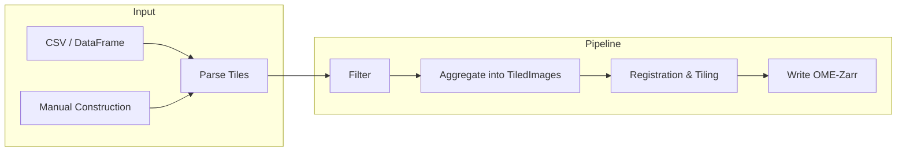

# Welcome to OME-Zarr Converters Tools

OME-Zarr Converters Tools is a Python library that provides shared utilities for building OME-Zarr image converters. It handles tile management, image registration, filtering, validation, and writing OME-Zarr datasets, with optional [Fractal](https://fractal-analytics-platform.github.io/fractal-server/) integration for parallel processing.

## Features

1. **Abstraction layer** for building OME-Zarr images and HCS plates from microscope metadata and image data
2. **Customizable pipeline** for filtering, validating, registering, and tiling images
3. **Python API** for building custom converters, with optional Fractal integration for parallel processing
4. **Flexible input**: parse tiles from CSV/DataFrame tables or construct them programmatically

### Architecture Diagram


## Main Concepts

In general a single microscopy image is not acquired as a single big array in a single file, but rather as multiple smaller tiles. How atomic these tiles are depends on the specific microscope and the acquisition settings.

To make building converters easier, OME-Zarr Converters Tools provides an abstraction layer that allows you to map these on-disk raw data to an image object which we call a `Tile`.

Usually a single microscopy image is not composed of a single tile, but rather multiple tiles that are stitched together to form a complete image. We call these composite objects `TiledImage`.



## Two Workflows

OME-Zarr Converters Tools supports two main workflows, distinguished by the **collection type**:

### HCS Plates (`ImageInPlate`)
For high-content screening applications where multiple images are organized in a multi-well plate layout. Each image is placed in a specific well (row/column) of the plate, following the OME-Zarr HCS specification. Use `hcs_images_from_dataframe()` to parse tiles from a CSV table, or set `collection=ImageInPlate(plate_name=..., row=..., column=...)` when building tiles manually.

### Single Images (`SingleImage`)
For standalone image conversions without plate structure. Each `TiledImage` produces an independent OME-Zarr dataset. Use `single_images_from_dataframe()` to parse tiles from a CSV table, or set `collection=SingleImage(image_path=...)` when building tiles manually.

See the [Tutorial](tutorial.ipynb) for a hands-on walkthrough of each workflow, and the `examples/` directory in the repository for sample input data.

## Pipeline Overview

The typical conversion pipeline follows these steps:

1. **Parse metadata** into `Tile` objects (from CSV/DataFrame or programmatically)
2. **Filter** tiles to include/exclude specific images or wells
3. **Aggregate** tiles into `TiledImage` objects using `tiles_aggregation_pipeline()`
4. **Register** tile positions using `build_default_registration_pipeline()`
5. **Write** OME-Zarr datasets using `tiled_image_creation_pipeline()`

See the [Pipeline Configuration](pipeline.md) page for details on filters, registration steps, tiling modes, and writer modes.

## Extensibility

The library is designed to be extended:

- **Custom image loaders**: implement `ImageLoaderInterface` to load any image format (see [Tutorial](tutorial.ipynb#step-2-manual-tile-construction-advanced))
- **Custom pipeline steps**: add [registration](pipeline.md#custom-registration-steps), [filtering](pipeline.md#custom-filters), or validation steps
- **Custom collection types**: register new collection handlers via `add_collection_handler()`

## Installation

Install via pip:

```bash
pip install ome-zarr-converters-tools
```
